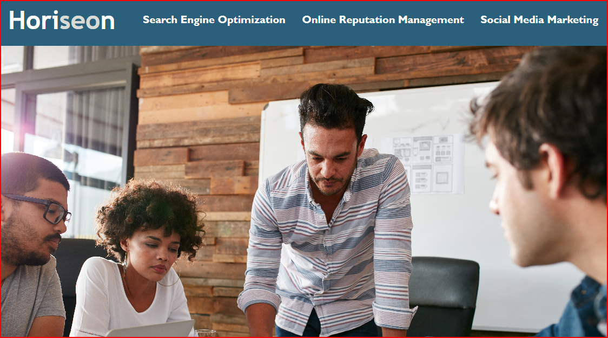

# Inclusion-Project
## Description

Code editing and Support for Horiseon Webpage

Code was copied and pasted into VS code for editing.

Notes where added to changes.

Alt tags were added to images for readers to know what a picture is.

Strong tags were added to site links to emphasize importance.

Code was seperated and formatted for better viewing.

## Table of Contents

- [Description](#Description)
- [Project URL](#Project-URL)
- [Deployment](#Deployment)
- [Demo/Screenshots](#Demo/Screenshots)
- [Technologies](#Technologies)
- [License](#License)
- [Resources](#Resources)
- [Contact](#Contact)
- [Author](#Author)

## Project URL

<https://kaleikautakaoka.github.io/Inclusion-Project/>

## Delpoyment

- [https://kaleikautakaoka.github.io/Inclusion-Project/](https://kaleikautakaoka.github.io/Inclusion-Project/)

## Demo/Screenshots

  <table>
    <tr>
      <td>Page Example</td>
    </tr>
    <tr>
      <td></td>
    </tr>
  </table>

## Technologies

```
HTML, CSS
```

## License

This project is not licensed.

## Resources

- [pixabay](https://pixabay.com/)
- [w3schools](https://www.w3schools.com/)

## Contact

Email: sachi@gmail.com

## Author

Author(s): Sachi Kaleikau-Takaoka
GitHub: <https://github.com/kaleikautakaoka/Inclusion-Project>


[Project Image](assets/images/inclusionpic.png)
